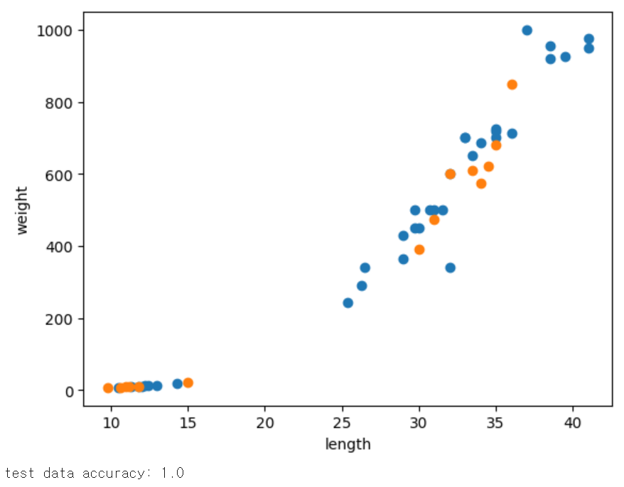
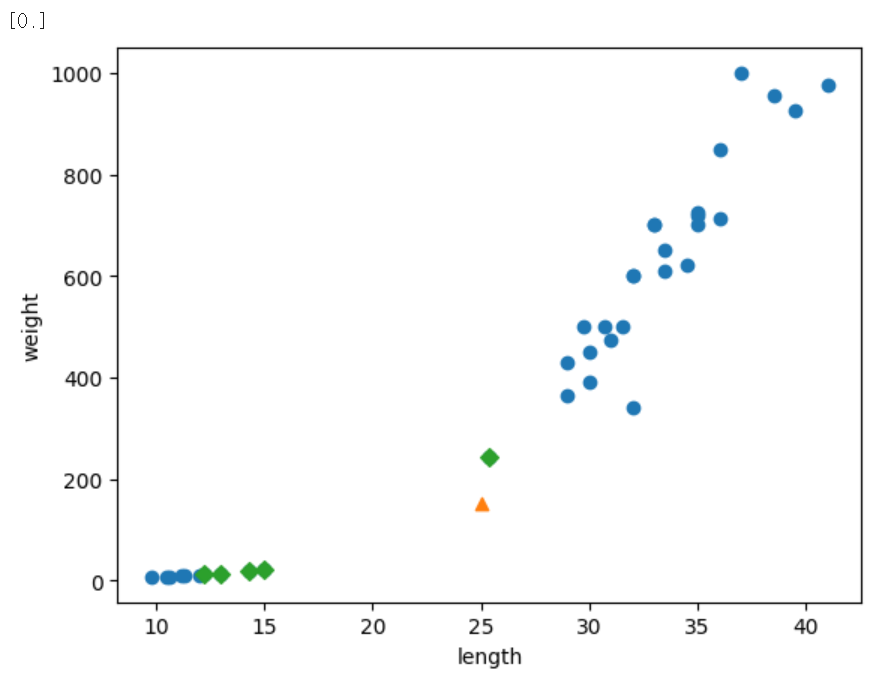
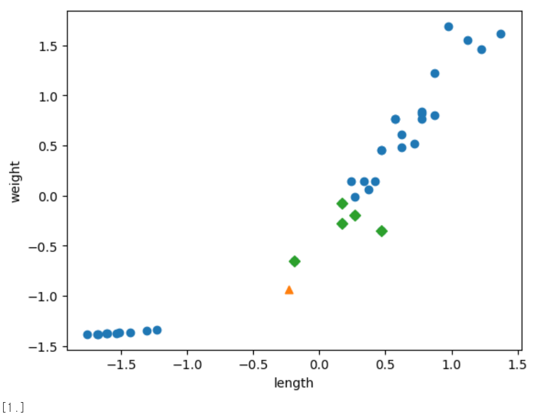

# week01

# 혼공머 : Ch 2 데이터 다루기

## 2.1 훈련 세트와 테스트 세트

### 2.1.1 지도 학습과 비지도 학습

- 지도 학습
    - 타겟 데이터를 사용하여 학습하는 알고리즘
    - 예) k-최근접 이웃 알고리즘
- 비지도 학습
    - 타겟 데이터가 없고 입력만 가지고 학습하는 알고리즘
- 강화학습
    - 모델이 행동 수행 후, 주변 환경에서 피드백을 받아 개선하는 알고리즘

### 2.1.2 물고기 이진 분류 알고리즘

```python
import numpy as np
import matplotlib.pyplot as plt
from sklearn.neighbors import KNeighborsClassifier

# 1. 데이터 준비
fish_length = [25.4, 26.3, 26.5, 29.0, 29.0, 29.7, 29.7, 30.0, 30.0, 30.7, 31.0, 31.0,
                31.5, 32.0, 32.0, 32.0, 33.0, 33.0, 33.5, 33.5, 34.0, 34.0, 34.5, 35.0,
                35.0, 35.0, 35.0, 36.0, 36.0, 37.0, 38.5, 38.5, 39.5, 41.0, 41.0, 9.8,
                10.5, 10.6, 11.0, 11.2, 11.3, 11.8, 11.8, 12.0, 12.2, 12.4, 13.0, 14.3, 15.0]
fish_weight = [242.0, 290.0, 340.0, 363.0, 430.0, 450.0, 500.0, 390.0, 450.0, 500.0, 475.0, 500.0,
                500.0, 340.0, 600.0, 600.0, 700.0, 700.0, 610.0, 650.0, 575.0, 685.0, 620.0, 680.0,
                700.0, 725.0, 720.0, 714.0, 850.0, 1000.0, 920.0, 955.0, 925.0, 975.0, 950.0, 6.7,
                7.5, 7.0, 9.7, 9.8, 8.7, 10.0, 9.9, 9.8, 12.2, 13.4, 12.2, 19.7, 19.9]
                
fish_data = [[l, w] for l, w in zip(fish_length, fish_weight)]
fish_target = [1]*35 + [0]*14 

# 2. Numpy 배열로 변환
input_arr = np.array(fish_data)
target_arr = np.array(fish_target)

# 3. 데이터 섞기
np.random.seed(42)       
index = np.arange(49)    
np.random.shuffle(index)

# 4. 훈련 및 테스트 데이터 분할
train_input = input_arr[index[:35]]
train_target = target_arr[index[:35]]

test_input = input_arr[index[35:]]
test_target = target_arr[index[35:]]

# 5. 산점도 시각화
plt.scatter(train_input[:, 0], train_input[:, 1])
plt.scatter(test_input[:, 0], test_input[:, 1])
plt.xlabel('length')
plt.ylabel('weight')
plt.show()

# 6. 모델 학습 및 평가
kn = KNeighborsClassifier()
kn.fit(train_input, train_target)

# 7. 결과 출력
print("test data accuracy:", kn.score(test_input, test_target))         
```

<출력 화면>



- 훈련 데이터와 테스트 데이터
    - 훈련 데이터 → 모델이 학습할 때 사용
    - 테스트 데이터 → 모델의 성능을 평가할 때 사용
- k-최근접 이웃(KNN) 알고리즘
    
    : 새로운 데이터 주변에 가장 가까이 있는 데이터(이웃)들을 보고, 다수결로 새로운 데이터의 정체를 파악하는 알고리즘
    
    - k : 참고할 주변 데이터 개수 (기본값 : 5)
    - 데이터를 모두 저장한 뒤, 새로운 데이터가 들어오면 기존 데이터와의 거리를 재서 비교
    
    ```python
    # KNN 알고리즘
    
    0. 데이터 준비 
    : 특성 데이터(X) + 타겟 데이터(y)
    -> 훈련 세트 + 테스트 세트로 나누기 : 데이터를 무작위로 섞은 뒤 나눔
    * 특성 데이터(X)는 반드시 2차원 배열이어야 함
    * 타겟 데이터(y)는 1차원 배열(0과 1)을 기본으로 함
    	
    1. 모델 생성 
    : knn = KNeighborsClassifier(n_neighbors=5)
    : n_neighbors를 매개변수로 참고할 이웃의 수(k) 지정
    
    2. 모델 학습 
    : knn.fit(X_train, y_train) 
    
    3. 모델 평가
    : accuracy = knn.score(X_test, y_test)
    
    4. 새로운 데이터로 예측
    new_date = [[~, ~]]
    prediction = knn.predict(new_data)
    ```
    
    - 핵심 코드
        1. 모델 생성
            
            `knn = KNeighborsClassifier(n_neighbors=5)`
            
            → `KNeighborsClassifier`  Class의 객체 knn 생성
            
            *`knn.func_name()` : 생성된 knn 객체 내부 메서드 func_name 호출
            
        2. 모델 학습
            
            `knn.fit(X_train, y_train)`
            
            : 모델에게 훈련용 문제(`X_train`)와 훈련용 정답(`y_train`)을 함께 제공
            
            → 모델이 데이터의 패턴 학습 
            
            - 학습 방식
                
                : 입력받은 두 데이터를 메모리에 저장
                
        3. 모델 평가
            
            `knn.score(X_test, y_test)` 
            
            : 모델에게 테스트용 문제(`X_test`)를 제공
            
            → 모델의 답과 테스트용 정답(`y_test`)을 비교
            
            → 올바르게 분류된 데이터의 비율을 0.0~1.0 사이의 float값(정확도)으로 반환
            
        4. 실전 예측
            
            `knn.predict(new_data)`
            
            : 모델에게 정답을 모르는 새로운 문제(`new_data`)를 제공
            
            → 모델이 학습한 패턴을 토대로 정답 도출
            
            - 예측 방식
                
                1 새로운 데이터(`new_data`)와 메모리에 저장된 기존 데이터(`X_train`) 사이의 거리를 모두 계산
                
                2 계산한 거리 중 가장 가까운 k개를 찾음
                
                3 찾은 기존 데이터 k개의 정답 데이터(`y_train`) 중 다수결로 최종 정답 결정
                
                *예측하고자 하는 새로운 데이터 셋(`new_data`)은 모델이 학습할 때 사용한 데이터(`X_train`)과 같이 2차원 배열이어야 함
                

### 2.1.3 샘플링 편향

: 모델을 학습시킬 데이터와 평가할 데이터가 골고루 섞이지 않고 특정 종류의 데이터에만 치우쳐 있는 현상

- 해결 방법
    - 넘파이(Numpy) 배열 변환
    - 인덱스 배열 생성 및 섞기 : `np.random.shuffle()` 함수 사용
    

## 2.2 데이터 전처리

```python
import numpy as np
import matplotlib.pyplot as plt
from sklearn.model_selection import train_test_split
from sklearn.neighbors import KNeighborsClassifier

# 1. 넘파이로 데이터(도미와 빙어 길이/무게) 준비
fish_length = [25.4, 26.3, 26.5, 29.0, 29.0, 29.7, 29.7, 30.0, 30.0, 30.7, 31.0, 31.0,
                31.5, 32.0, 32.0, 32.0, 33.0, 33.0, 33.5, 33.5, 34.0, 34.0, 34.5, 35.0,
                35.0, 35.0, 35.0, 36.0, 36.0, 37.0, 38.5, 38.5, 39.5, 41.0, 41.0, 9.8,
                10.5, 10.6, 11.0, 11.2, 11.3, 11.8, 11.8, 12.0, 12.2, 12.4, 13.0, 14.3, 15.0]
fish_weight = [242.0, 290.0, 340.0, 363.0, 430.0, 450.0, 500.0, 390.0, 450.0, 500.0, 475.0, 500.0,
                500.0, 340.0, 600.0, 600.0, 700.0, 700.0, 610.0, 650.0, 575.0, 685.0, 620.0, 680.0,
                700.0, 725.0, 720.0, 714.0, 850.0, 1000.0, 920.0, 955.0, 925.0, 975.0, 950.0, 6.7,
                7.5, 7.0, 9.7, 9.8, 8.7, 10.0, 9.9, 9.8, 12.2, 13.4, 12.2, 19.7, 19.9]
 
fish_data = np.column_stack((fish_length, fish_weight))
fish_target = np.concatenate((np.ones(35), np.zeros(14)))   

#2. 사이킷런으로 훈련 세트와 테스트 세트 나누기
train_input, test_input, train_target, test_target = train_test_split(
    fish_data, fish_target, stratify=fish_target, random_state=42)
```

- `np.column_stack()`  : 1차원 리스트 2개를 2차원 배열(행렬)로 묶음
- `np.ones()`  : 1로 채워진 배열 생성
- `np.zeros()`  : 0으로 채워진 배열 생성
- `np.concatenate()`  : 두 배열을 한 줄로 길게 이어 붙임
- `stratify=fish_target` : 도미와 빙어가 훈련용/테스트용에 원래 비율대로 잘 섞이도록 함

```python
#3.수상한 도미 (물고기 종류 예측 : 도미 or 빙어)
kn = KNeighborsClassifier()
kn.fit(train_input, train_target)
kn.score(test_input, test_target)

# [25, 150] 물고기 종류 예측
print(kn.predict([[25, 150]]))

# [25, 150] 물고기 데이터의 이웃 5개를 찾아 시각화
distances, indexes = kn.kneighbors([[25, 150]])

plt.scatter(train_input[:,0], train_input[:,1])

plt.scatter(25, 150, marker='^') 
plt.scatter(train_input[indexes,0], train_input[indexes,1], marker='D') 
plt.xlabel('length')
plt.ylabel('weight')
plt.show()
```

<출력 화면>



- 문제 발생
    - `kn.predict([[25, 150]])`  실행 결과, 도미(1)를 빙어(0)로 잘못 예측함
- 문제 원인 : 스케일 불균형
    - 길이(10~40)와 무게(0~1000)의 단위(스케일) 차이가 너무 큼
    - KNN 알고리즘은 거리를 잴 때 숫자가 큰 무게 쪽으로만 판단이 쏠림 (길이 차이 거의 반영 안 됨)

```python
#4. 기준을 맞춰라

# 훈련 데이터의 평균 및 표준편차 계산
mean = np.mean(train_input, axis=0)
std = np.std(train_input, axis=0)

# 표준점수 = (데이터 - 평균) / 표준편차
train_scaled = (train_input - mean) / std
```

- 해결 방법 : 표준점수 전처리
    - 열별 통계치 계산
        - 길이는 길이끼리, 무게는 무게끼리 기준 맞춤
        - `mean = np.mean(train_input, axis=0)` (평균)
        - `std = np.std(train_input, axis=0)`  (표준편차)
            
            → `axis=0`  :  '행'을 따라 각 '열'의 통계치를 독립적으로 계산
            
    - 훈련 데이터 변환
        - `train_scaled = (train_input - mean) / std`

```python
#5. 전처리 데이터로 모델 훈련하기

# 수상한 도미 데이터 변환
new = ([25, 150] - mean) / std

# 전처리된 훈련 데이터로 새로운 모델 학습
kn.fit(train_scaled, train_target)

# 테스트 데이터 변환
test_scaled = (test_input - mean) / std

kn.score(test_scaled, test_target)

distances, indexes = kn.kneighbors([new])

plt.scatter(train_scaled[:,0], train_scaled[:,1])
plt.scatter(new[0], new[1], marker='^')
plt.scatter(train_scaled[indexes,0], train_scaled[indexes,1], marker='D')
plt.xlabel('length')
plt.ylabel('weight')
plt.show()

# 변환된 수상한 도미 데이터 예측
print(kn.predict([new]))
```

<출력 화면>



- 전처리된 데이터로 재학습 및 예측 → 성공
    - `kn.fit(train_scaled, train_target)`